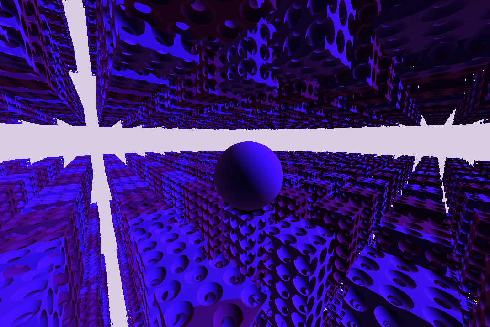

<div align="center">

# MSdf-Renderer

[MiniSdf](https://gitlab.com/tendsinmende/minisdf) test renderer.

</div>


## Usage

Start the renderer with `cargo run --bin msdf-renderer` The renderer uses `sdf.minisdf` as the injected SDF code. If no such file exists, one is created.

The renderer watches the file and recompiles it if necessary. So feel free to live-edit. Only valid code is sent to the GPU.

## Syntax

OPs:
```
Unary Operations:
repeat(x: float, y: float, z: float) => repeats the SDF domain in the given box-bound infinitely
translate(translation: vec3) => translates the inner tree 
smooth(radius: float) => smooths the inner SDF with the given radius

Binary Operations
Union => combines two SDFs
Intersection => builds the intersection of both SDFs
Subtract => Removes the second sdf from the first

```

Primitives:

```
Plane(normal: vec3, height: f32) => creates a plane with the given normal moved up/down by `height`
Torus(r0: float, r1: float) => A torus defined the ring-radius r0 and the ring's circumflex of r1
Box(half_extent: vec3) => a box defined by its half_extent
Sphere(radius: float) => sphere defined by its radius
```

Example:

``` 
field myfield(offset: vec3){
    union(){
        repeat(3.0, 10.0, 4.0){
            sub(){
                box(vec3(1.0, 2.0, 1.0))
            }{
                repeat(0.75, 0.75, 0.75){
                    sphere(0.4)
                }
            }
        }
    }{
        translate(offset){
            sphere(1.75)
        }
    }
}
```

This code creates this SDF. Note that the sphere's translation is controlled by the field's offset parameter. This lets us control the sphere as described 
in _Controls_ without having to recompile the field.



## Controls

Camera:

- `W/A/S/D`: Translation
- `Q/E`: Vertical translation
- Mouse: Camera rotation

Offset Parameter:

- `I/J/K/L`: Translation
- `O/U`: Vertical translation

## Contributing

You are welcome to contribute. All contributions are licensed under the MPL v2.0.

Note that the project is currently in its early stages. Actual contribution might be difficult.

## License

The whole project is licensed under MPL v2.0, all contributions will be licensed the same. Have a look at Mozilla's [FAQ](https://www.mozilla.org/en-US/MPL/2.0/FAQ/) to see if this fits your use-case.

